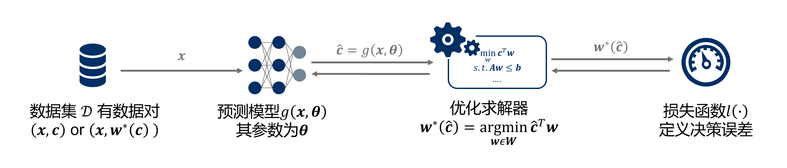
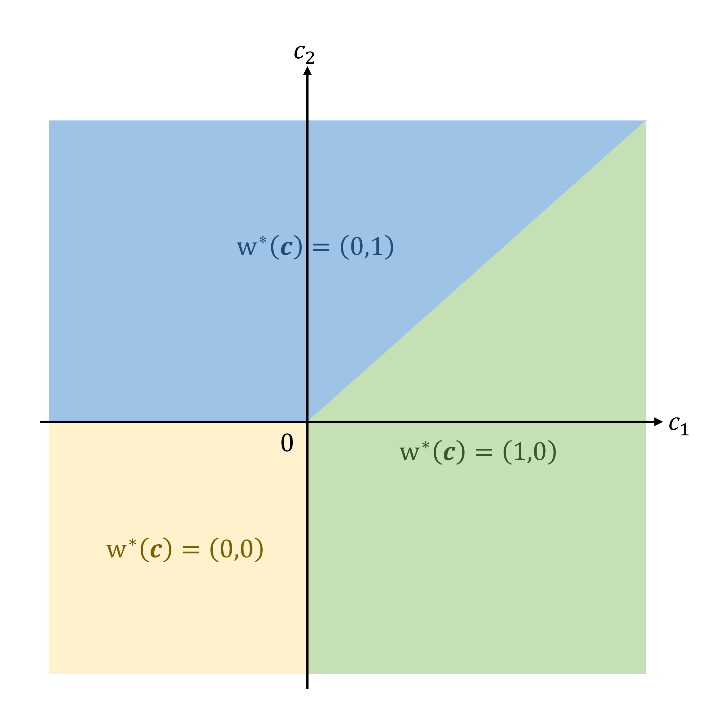
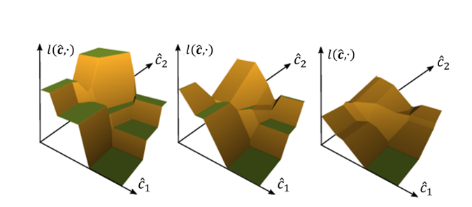
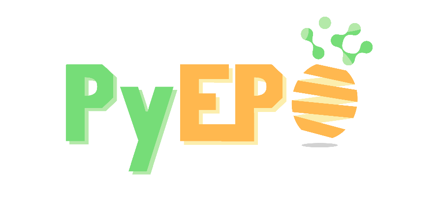

# 当机器学习遇上运筹学：PyEPO与端对端预测后优化

#### 摘要：

本文中将介绍并探讨端对端预测后优化（End-to-End Predict-then-Optimize），并着重关注其在具有线性目标函数的问题，如线性规划（LP）和整数线性规划（ILP）问题上。这种独特的方法结合了运筹学和机器学习的优势。我们将解析它的工作原理，对其与传统方法的优缺点进行比较，展示多种前沿的算法，并运用开源工具PyEPO进行实际演示。我们希望通过这篇文章，读者可以对这个领域有更深入的理解，同时也期待这种方法能为实际决策问题提供更有效的解决方案。

#### 编者按：

这篇文章我想要写已经很久了，毕竟“端对端预测后优化”（End-to-End Predict-then-Optimize）正是我读博期间的主要研究方向，但我又一直迟迟没能下笔。想说自己杂事缠身（实际是重度拖延症晚期的缘故），更主要的原因恐怕是我对这一领域理解依然尚浅，尤其我希望以综述的形式，为读者提供详尽的介绍。然而，这篇文章并不能称为一篇综述，原因有二：一方面，我虽然进行相关的研究，但还无法自称为专家；另一方面，"端对端预测后优化"还处于起步阶段，有很大的探索空间，尚有无穷可能。因此，此时编写综述可能为时尚早。因此，我选择用这篇文章抛砖引玉，旨在引发关于这个领域的进一步探讨和思考。


## 引言

运筹学和统计学/数据科学/机器学习的紧密关系由来已久。机器学习通过挖掘数据，预测未知或不确定的信息，一旦得到预测结果，常常需要进行进一步的决策行动来获取收益。而运筹学作为建模求解最优化问题的工具，尽管可以（相对）高效地找到最优解，但一大限制是通常需要参数（无论是本身还是其分布）的确定性，无法充分利用数据。

本文就是要讨论数据驱动下，带有不确定参数的优化问题。这种问题通常通过“预测后优化”的范式来解决。这一问题在现实生产生活中有着深远的意义。举例来说，车辆路径规划中，由于交通状况的不断变化，每段道路的行驶时间是不确定的；电网调度中，不同地区的电力负荷也会随时间发生变化；投资组合中，金融资产的收益率会受到市场波动的影响。以上这些情况都涉及到优化模型参数的不确定性，但是，我们可以利用时间、天气、金融因素等特征，预测这些不确定的参数，从而进行最优决策。

此外，本文也会介绍一个端对端预测后优化的开源框架PyEPO (<https://github.com/khalil-research/PyEPO>)。PyEPO基于PyTorch， 针对线性规划（LP）和整数线性规划（ILP）集成了多种算法，并提供了Gurobi、Pyomo等优化建模工具的API。PyEPO可以作为PyTorch的autograd模块进行深度学习的训练和测试，使用起来简洁明了。这个框架的设计目标是为广大学界和业界用户提供便捷的工具，帮助大家更好地理解和应用“端对端预测后优化”。


# 问题描述和符号

首先，请各位读者放心，本文并不打算深入挖掘“端对端预测后优化”背后的数学推导，而是致力于提供一些直观的理解。

我们以一个简单的线性优化问题为例：

$$
\begin{aligned}
\underset{w_1,w_2}{\max} \quad & c_1 w_1+c_2 w_2 \\
s.t. \quad & w_1 + w_2 \leq 1 \\
& w_1, w_2 \geq 0
\end{aligned}
$$

在这里，$\mathbf{w} = (w_1,w_2)$代表的是决策变量，$\mathbf{W} = \lbrace w_1 + w_2 ≤ 1，w_1, w_2 ≥ 0 \rbrace$定义了可行域，而$\mathbf{c}=(c_1,c_2)$就是我们不确定的成本向量。

给定成本向量$\mathbf{c}$，由于退化问题的存在，优化问题可能得到多个最优解，但可以假定使用某种特定的求解器（如Gurobi）时，只返回唯一一个最优解$\mathbf{w}^* (\mathbf{c})$。

有一组数据$\mathbf{D} = \lbrace(\mathbf{x}^1,\mathbf{c}^1), (\mathbf{x}^2,\mathbf{c}^2), ⋯, (\mathbf{x}^n,\mathbf{c}^n)\rbrace$，其中$\mathbf{x}$为数据特征，我们可以利用机器学习模型$\mathbf{g}(\mathbf{x},\boldsymbol{\theta})$来最小化某个损失函数$l(\mathbf{g}(\mathbf{x},\boldsymbol{\theta}),\mathbf{c})$。其中，$\boldsymbol{\theta}$是模型$\mathbf{g}(\mathbf{x},\boldsymbol{\theta})$的参数，会在训练过程中不断更新，而$\hat{\mathbf{c}} = \mathbf{g}(\mathbf{x},\boldsymbol{\theta})$则是成本向量$\mathbf{c}$的预测值。由此我们可以利用数据驱动的方式来预测不确定的参数，帮助实现优化决策。

## 什么是端对端预测后优化？

在回答这个问题之前，我们首先需要理解端对端学习（End-to-End Learning）的理念。端对端的这个“端”，指的是输入端和输出端。相比于传统的分步骤方式，它并不依赖于中间过程的手动特征工程或者人为设计的步骤，而直接构建从输入到输出的映射，以一种更直接和自动的方式解决问题。这种简化不仅减轻了手动特征工程的负担，而且通过学习直接的映射，减少了对中间结果的依赖，有可能发现传统方法难以发现的模式，从而提高整体的性能。端对端学习作为一个整体，使得整个系统变得更简洁，有利于处理复杂和高维度的问题。



对于端对端预测后优化，我们在训练机器学习模型$\mathbf{g}(\mathbf{x},\boldsymbol{\theta})$的过程中，模型预测了成本向量$\hat{\mathbf{c}} = \mathbf{g}(\mathbf{x},\boldsymbol{\theta})$，然后通过求解器得到最优解$\mathbf{w}^* (\hat{\mathbf{c}}) = \underset{\mathbf{w} \in \mathbf{W}}{\min} \hat{\mathbf{c}}^{\top} \mathbf{w}$，并计算损失函数$l(\mathbf{w}^* (\hat{\mathbf{c}}),\mathbf{c})$来直接衡量决策损失。

因此，对于依赖于链式法则进行反向传播的模型（如神经网络），关键部分是计算求解过程的梯度$\frac{\partial \mathbf{w}^* (\hat{\mathbf{c}})}{\partial \hat{\mathbf{c}}}$。端对端预测后优化的各类算法几乎都是在此基础上展开的。然而，在此，我们先不深入讨论这些算法，因为我们我们必须先回答一个更为重要，也是更致命的问题：


## 为什么要使用端对端预测后优化？

### 关于两阶段的预测后优化

毫无疑问，采用两阶段的预测后优化，即将机器学习预测模型$\mathbf{g}(\mathbf{x},\boldsymbol{\theta})$和优化求解器$\mathbf{w}^* (\mathbf{c})$独立使用，看似是一个更为自然、直接的做法。此方法的预测任务中，我们最小化成本向量预测值$\hat{\mathbf{c}} = \mathbf{g}(\mathbf{x},\boldsymbol{\theta})$和真实值$\mathbf{c}$之间的预测误差，如均方误差$l_{\text{MSE}} (\hat{\mathbf{c}},\mathbf{c}) = {\lVert \hat{\mathbf{c}}-\mathbf{c} \rVert}^2$。熟悉机器学习的读者可能会发现，这实际上是一项非常经典的回归任务，对应的模型和算法已经相当成熟。而在决策任务中，一旦给定预测参数$\hat{\mathbf{c}}$，现代求解器可以将问题视作确定性优化直接求解。既然预测任务和决策任务都有成熟的方案，那么为什么我们还要尝试将它们结合在一起？

文献中的解释——“基于预测误差训练预测模型与直接考虑决策误差相比，基于预测误差训练预测模型会导致更糟糕的决策。”用人话来说就是：像$l_{\text{MSE}} (\hat{\mathbf{c}},\mathbf{c})$这样的预测误差，不能准确地衡量决策的质量。

在日常生活中，人们只关心决策的好坏，而非对各项指标预测的准确度。正如我们驱车赶往目的地时，只关心自己是否选中捷径，而无须精确预测每段可能经过的路段耗费的时间。

让我们回到前文提到的线性优化问题：假设实际成本向量为$\mathbf{c}=(0,1)$，最优解为$\mathbf{w}^* (\mathbf{c}) = (0,1)$。当我们将成本向量预测为$\hat{\mathbf{c}}  = (1,0)$，其最优解为$\mathbf{w}^* (\hat{\mathbf{c}}) = (1,0)$，预测的均方误差$l_{\text{MSE}} (\hat{\mathbf{c}},\mathbf{c}) = 2$；当我们将成本向量预测为$\mathbf{w}^* (\hat{\mathbf{c}}) = (0,3)$，其最优解为$\mathbf{w}^* (\hat{\mathbf{c}}) = (0,1)$，预测的均方误差$l_{\text{MSE}} (\hat{\mathbf{c}},\mathbf{c}) = 4$。

这个例子揭示了一个有趣的现象：后者虽然在预测误差上比前者大，但在决策上却是最优的。

因此，即使预测模型表现出了较大的误差，但只要预测的成本向量能引导我们做出正确的决策，这个预测模型就是有效的。这就是为什么我们需要考虑端对端预测后优化，我们希望训练出的模型能够引导我们做出最优的决策，而不必预测出精确的成本向量。

那么，如果预测模型的预测结果足够精确，那是不是可以摒弃使用端对端方法了呢？答案是肯定的。然而，不要忘记统计学家George E.P. Box有句名言： “All models are wrong, but some are useful.”

### 关于模仿学习

既然端对端方法展现了足够的优势，那我们为什么不妨更激进一点，采用模仿学习（Imitation Learning），把（最优）决策行为$\mathbf{w}^* (\mathbf{c})$作为标签，省去了中间的求解过程，直接训练模型$\hat{\mathbf{w}}^* = \mathbf{g}(\mathbf{x},\boldsymbol{\theta})$预测最优解呢？

毫无疑问，模仿学习在计算效率上具有显著优势，因为它规避了计算效率的主要瓶颈：优化求解。

然而，其局限性也很明显。尽管研究人员已经做出了许多尝试，比如Kervadec等人的“Constrained deep networks: Lagrangian optimization via log-barrier extensions” [8]，但目前的预测模型在处理带有硬约束（Hard Constraints）的问题上仍存在难度。因此，模仿学习的预测结果常常面临可行性问题，特别是对于高维度、有复杂约束的优化问题。


## 如何进行端对端预测后优化？

尽管也存在基于决策树的模型SPO Tree [9]，大部分方法还是依赖梯度下降更新参数。之前提到，端对端学习的关键是计算求解过程的梯度$\frac{\partial \mathbf{w}^* (\hat{\mathbf{c}})}{\partial \hat{\mathbf{c}}}$。

然而，坏消息是：线性规划、整数线性规划等具有线性目标函数的问题，其最优解$\mathbf{w}^* (\mathbf{c})$作为成本向量$\mathbf{c}$的函数，是一个分片常数函数（Piecewise Constant Function），它的一阶导数要么为0，要么不存在。我们依然以线性规划$\underset{w_1,w_2}{\max} \lbrace c_1 w_1+c_2 w_2: w_1 + w_2 ≤ 1，w_1, w_2 ≥ 0 \rbrace$为例，如图：



既然梯度几乎处处为0，梯度下降法似乎无法实施。然而，科研的魅力正是将不可能变为可能。面对这一挑战，研究者们提出了多种解决策略：一类是寻找替代的梯度信息，用以更新模型参数；另一类索性重新设计一个（有非0梯度的）替代损失函数。这两类思路基本囊括了基于梯度的端对端预测后优化算法：

### 基于KKT条件的隐函数求导

Amos和Kolter提出“OptNet” [10] ，通过求解KKT条件的偏微分矩阵线性方程组来计算求解器反向传播的梯度。为了克服线性规划中无法得到非0梯度的问题，Wilder等人 [11] 在线性目标函数中加入了一个微小的二次项。基于这类方法，后续的研究者展开了多方面的探索。例如，引入割平面法（Cutting-Plane Method）以处理整数问题 [12] ，或使用障碍函数来替代拉格朗日罚函数 [13] 。

### SPO+

不同于KKT方法，Elmachtoub和Grigas [1] 为目标函数是线性（$\mathbf{c}^{\top} \mathbf{w}$）的决策误差找到了一个凸且可导的替代损失函数SPO+ Loss。

在这里，对于一个最小化问题$\underset{\mathbf{w} \in \mathbf{W}}{\min} \mathbf{c}^{\top} \mathbf{w}$，我们先定义一个决策误差$l_{\text{Regret}} (\hat{\mathbf{c}}, \mathbf{c}) = \mathbf{c}^{{\top}} \mathbf{w}^* (\hat{\mathbf{c}}) - \mathbf{c}^{{\top}} \mathbf{w}^* (\mathbf{c})$，衡量实际成本向量$\mathbf{c}$下，根据预测成本向量$\hat{\mathbf{c}}$产生的最优解$\mathbf{w}^* (\hat{\mathbf{c}})$和实际最优解$\mathbf{w}^* (\mathbf{c})$在目标值上的差距，也可以理解为优化间隙（optimality gap）。

由于$\mathbf{w}^* (\mathbf{c})$没有非0导数，这个损失函数同样也没有非0导数。Elmachtoub和Grigas [1] 找到了这个函数的一个凸上界作为替代：

$$
l_{\text{SPO+}} (\hat{\mathbf{c}}, \mathbf{c}) = - \underset{\mathbf{w} \in \mathbf{W}}{\min} \{(2 \hat{\mathbf{c}} - \mathbf{c})^{\top} \mathbf{w}\} + 2 \hat{\mathbf{c}}^{\top} \mathbf{w}^* (\mathbf{c}) - \mathbf{c}^{{\top}} \mathbf{w}^* (\mathbf{c})
$$

对于损失函数$l_{\text{SPO+}} (\hat{\mathbf{c}}, \mathbf{c})$，有次梯度：

$$
2 \mathbf{w}^* (\mathbf{c}) - 2 \mathbf{w}^* (2 \hat{\mathbf{c}} - \mathbf{c}) \in \frac{\partial l_{\text{SPO+}}(\hat{\mathbf{c}}, \mathbf{c})}{\partial \hat{\mathbf{c}}}
$$

### 扰动方法

同样是线性目标函数，扰动方法则是另辟蹊径，引入随机扰动来处理成本向量的预测值$\hat{\mathbf{c}}$。

Berthet等人 [4] 用在高斯随机扰动$\boldsymbol{\xi}$下最优决策的期望值$\mathbb{E}^{\boldsymbol{\xi}} [\mathbf{w}^* (\hat{\mathbf{c}} + \sigma \boldsymbol{\xi})]$代替$\mathbf{w}^* (\hat{\mathbf{c}})$。如图所示，$\mathbf{w}^* (\hat{\mathbf{c}} + \sigma \boldsymbol{\xi})$是可行域极点（基本可行解）的离散型随机变量，决策的期望值$\mathbb{E}^{\boldsymbol{\xi}} [\mathbf{w}^* (\hat{\mathbf{c}} + \sigma \boldsymbol{\xi})]$实际上可视为可行域极点​​​​​​​的加权平均（凸组合）。与$\mathbf{w}^* (\hat{\mathbf{c}})$不同，只要$\hat{\mathbf{c}}$在$\mathbb{E}^{\boldsymbol{\xi}} [\mathbf{w}^* (\hat{\mathbf{c}} + \sigma \boldsymbol{\xi})]$中发生一些微小的变化，可行域极点权重（其发生的概率）就会相应变化，这个思路和SoftMax有异曲同工之妙。


在实际操作中，我们用样本量为$K$的蒙特卡洛采样来近似期望：

$$
\mathbb{E}^{\boldsymbol{\xi}} [\mathbf{w}^* (\hat{\mathbf{c}} + \sigma \boldsymbol{\xi})] \approx \frac{1}{K}
 \sum_{\kappa}^K { \mathbf{w}^*(\hat{\mathbf{c}} + \sigma \boldsymbol{\xi}_{\kappa})} 
$$

由于$\mathbb{E}^{\boldsymbol{\xi}}  [\mathbf{w}^* (\hat{\mathbf{c}} + \sigma \boldsymbol{\xi})]$存在导数且非0，梯度问题因此引刃而解。

除了加法扰动，Dalle等人 [14] 进一步提出了乘法扰动，同样引入高斯随机扰动$\boldsymbol{\xi}$，但让预测成本向量$\hat{\mathbf{c}}$与$e^{\sigma \boldsymbol{\xi} - 1/2 {\sigma}^2}$对应位元素相乘。乘法扰动消除了加法扰动可能引起的正负号变化问题。在一些特定的应用中，例如Dijkstra算法等，对成本向量有非负性的要求，乘法扰动就非常有用。

基于扰动方法，Berthet等人 [4] 利用了Fenchel-Young对偶的性质，进一步构造了一个新的损失函数，用来降低$F^{\boldsymbol{\xi}}(\hat{\mathbf{c}}) = \mathbb{E}^{\boldsymbol{\xi}}[\underset{\mathbf{w} \in \mathbf{W}}{\min} {\{(\hat{\mathbf{c}}+\sigma \boldsymbol{\xi})^{\top} \mathbf{w}\}}]$的对偶间隙。令$\Omega (\mathbf{w}^*  ({\mathbf{c}}))$为$F^{\boldsymbol{\xi}}(\mathbf{c})$的对偶，则有：

$$l_{\text{PFY}}(\hat{\mathbf{c}}, \mathbf{w}^* ({\mathbf{c}})) =  \hat{\mathbf{c}}^{\top} \mathbf{w}^* ({\mathbf{c}}) - F^{\boldsymbol{\xi}}(\hat{\mathbf{c}}) - \Omega (\mathbf{w}^*  ({\mathbf{c}}))$$

这个损失函数可能看起来有些复杂，它甚至包含一个神秘的对偶函数$\Omega (\mathbf{w}^*  ({\mathbf{c}}))$。但是，当我们对其进行求导操作时，会发现$\Omega (\mathbf{w}^*  ({\mathbf{c}}))$实际上是常数，因此，梯度表达式非常简洁：

$$\frac{\partial l_{\text{PFY}}(\hat{\mathbf{c}}, \mathbf{w}^* ({\mathbf{c}}))}{\partial \hat{\mathbf{c}}} = \mathbf{w}^* ({\mathbf{c}}) - \mathbb{E}^{\boldsymbol{\xi}}  [\mathbf{w}^* (\hat{\mathbf{c}} + \sigma \boldsymbol{\xi})]$$

### 黑箱方法

面对$\mathbf{w}^* (\mathbf{c})$的不可导问题，有一个更加简单粗暴的方法，即将求解器函数视为一个“黑箱”，并利用解空间的几何形状等性质找到替代梯度。

如图所示，Pogancic等人 [3] 提出了“Differentiable Black-box”方法，引入一个插值超参数λ，对分片常数损失函数进行连续插值，从而将其转化为分片线性函数（Piecewise Affine Function），以此可得非0梯度。



此外，Sahoo等人 [7] 提出了一种相当简洁的方案，即用负单位矩阵$- \mathbf{I}$替代求解器梯度$\frac{\partial \mathbf{w}^* (\hat{\mathbf{c}})}{\partial \hat{\mathbf{c}}}$。我们可以将其称为“Negative Identity”方法。从直观角度理解，对于一个最小化问题$\underset{\mathbf{w} \in \mathbf{W}}{\min} \mathbf{c}^{\top} \mathbf{w}$，我们希望通过如下方式更新成本向量的预测值$\hat{\mathbf{c}}$：沿着$\mathbf{w}^* (\hat{\mathbf{c}})$上升的方向减少，沿着$\mathbf{w}^* (\hat{\mathbf{c}})$下降的方向增加，这会使$\mathbf{w}^* (\hat{\mathbf{c}})$接近最优决策$\mathbf{w}^* (\mathbf{c})$。另外，该研究也证明了，这个方法可以看作是“Differentiable Black-box”方法在特定超参数λ下的特例。

### 对比、排序方法：

Mulamba [5] 则是曲线救国，采用了 “噪声对比估计（Noise Contrastive Estimation）” 的技巧，以巧妙地计算出替代损失函数。由于我们的可行域$\mathbf{w} \in \mathbf{W}$是固定不变的，因此在训练集以及训练、求解过程中，我们可以自然地收集到大量的可行解，形成一个解集合$\Gamma$。

该方法的关键思路是，将非最优可行解的子集$\Gamma \setminus \mathbf{w}^* (c)$作为负样本，让最优解和其他解之间的的差值尽可能大。对于一个最小化问题$\underset{\mathbf{w} \in \mathbf{W}}{\min} \mathbf{c}^{\top} \mathbf{w}$，有：

$$
l_{\text{NCE}} (\hat{\mathbf{c}},\mathbf{c}) = \frac{1}{|\Gamma|-1} \sum_{\mathbf{w} \in {\Gamma \setminus {\mathbf{w}^* (\mathbf{c})}}}(\hat{\mathbf{c}}^{\top} \mathbf{w}^* (\mathbf{c})-\hat{\mathbf{c}}^{\top} \mathbf{w})
$$

基于这项工作，Mandi等人 [6] 提出了一种新思路，将端对端预测后优化任务转化为一个排序学习(Learning to rank) [15]，其目标是学习一个目标函数（如$\mathbf{c}^{\top} \mathbf{w}$）作为排序得分，以便对可行解的子集$\Gamma$进行正确排序。和之前的方法相比，这种方法的优势在于，它对使用的优化方法和目标函数的形式不加以限制。

例如，对于一个线性规划问题，$\mathbf{c}^{\top} \mathbf{w}$可以被视为排序得分。对于预测的成本向量$\hat{\mathbf{c}}$，为了排序得分$\hat{\mathbf{c}}^{\top} \mathbf{w}$能在解集$\mathbf{w} \in \Gamma$中有正确的排序（和使用真实成本向量$\mathbf{c}$时一致），我们可以采用以下三种经典的排序学习方法：单文档方法（Pointwise Approach）、文档对方法（Pairwise Approach）、以及文档列表方法（Listwise Approach）。

在单文档方法中，我们希望成本向量的预测值$\hat{\mathbf{c}}$在可行解的子集$\Gamma$中的得分$\hat{\mathbf{c}}^{\top} \mathbf{w}$尽可能接近$\mathbf{c}^{\top} \mathbf{w}$；在文档对方法中，我们可以在最优解和其他解之间创造排序得分的差值；而在文档列表方法中，我们根据排序得分使用SoftMax函数计算每个可能解$\mathbf{w} \in \Gamma$被排在最前面的概率$P(\mathbf{w} | \mathbf{c})$，然后定义损失为概率的交叉熵$l_{\text{LTR}} (\hat{\mathbf{c}},\mathbf{c}) = \frac{1}{|\Gamma|} \sum_{\mathbf{w} \in \Gamma} P(\mathbf{w} | \mathbf{c}) \log P(\mathbf{w} | \hat{\mathbf{c}})$。


## 使用PyEPO进行端对端预测后优化

PyEPO（PyTorch-based End-to-End Predict-then-Optimize Tool） [16] 是我读博期间的开发的工具，该工具的源代码已经发布在GitHub上，可以通过以下链接查找：<https://github.com/khalil-research/PyEPO>。它是一款基于Python的开源软件，支持预测后优化问题的建模和求解。PyEPO的核心功能是使用GurobiPy、Pyomo或其他求解器和算法建立优化模型，然后将优化模型嵌入到人工神经网络中进行端到端训练。具体来说，PyEPO借助PyTorch autograd模块，实现了如SPO+、黑箱方法、扰动方法以及对比排序方法等多种策略的框架。具体使用方法可以查看[文档](https://khalil-research.github.io/PyEPO)。



作为一款开源工具，PyEPO非常欢迎社区的反馈和贡献，我们也会持续更新并优化工具中的算法。

要下载PyEPO，你可以从GitHub仓库克隆：

```bash
git clone -b main --depth 1 https://github.com/khalil-research/PyEPO.git
```

之后进行安装：

```bash
pip install PyEPO/pkg/.
```

### 建立优化模型

使用PyEPO的第一步是创建一个继承于optModel类的优化模型。由于PyEPO处理未知成本系数的预测后优化，因此首先需要实例化一个具有固定约束和可变成本的优化模型optModel。这样一个优化模型可以接受不同的成本向量，并能够在固定的约束条件下找到相应的最优解。

在PyEPO中，optModel类的作用类似于一个黑箱对求解器进行封装，这意味着PyEPO并不一定要使用某种特定的算法或求解器。

对如下问题：

$$
\begin{aligned}
\underset{\mathbf{x}}{\max} & \sum_{i=0}^4 c_i x_i \\
s.t. \quad & 3 x_0 + 4 x_1 + 3 x_2 + 6 x_3 + 4 x_4 \leq 12 \\
& 4 x_0 + 5 x_1 + 2 x_2 + 3 x_3 + 5 x_4 \leq 10 \\
& 5 x_0 + 4 x_1 + 6 x_2 + 2 x_3 + 3 x_4 \leq 15 \\
& \forall x_i \in \{0, 1\}
\end{aligned}
$$

PyEPO也提供了Gurobi的API，用户能轻松地对各种优化问题进行建模，无需手动编写复杂的求解过程：

```python
import gurobipy as gp
from gurobipy import GRB
from pyepo.model.grb import optGrbModel

class myOptModel(optGrbModel):
    def _getModel(self):
        # ceate a model
        m = gp.Model()
        # varibles
        x = m.addVars(5, name="x", vtype=GRB.BINARY)
        # sense
        m.modelSense = GRB.MAXIMIZE
        # constraints
        m.addConstr(3*x[0]+4*x[1]+3*x[2]+6*x[3]+4*x[4]<=12)
        m.addConstr(4*x[0]+5*x[1]+2*x[2]+3*x[3]+5*x[4]<=10)
        m.addConstr(5*x[0]+4*x[1]+6*x[2]+2*x[3]+3*x[4]<=15)
        return m, x

optmodel = myOptModel()
```

### 生成数据集

我们用随机特征生成有高斯噪音的成本向量：

```python
import torch
torch.manual_seed(42)

num_data = 1000 # number of data
num_feat = 5 # feature dimension
num_cost = 5 # cost dimension

# randomly generate data
x_true = torch.rand(num_data, num_feat) # feature
weight_true = torch.rand(num_feat, num_cost) # weight
bias_true = torch.randn(num_cost) # bias
noise = 0.5 * torch.randn(num_data, num_cost) # random noise
c_true = x_true @ weight_true + bias_true + noise # cost coef
```

对于端到端预测后优化，只有成本向量$\mathbf{c}$作为标签是不够的，我们还需要最优解$\mathbf{w}^* (\mathbf{c})$和相应的目标函数值。因此，我们可以使用optDataset。optDataset是在PyTorch的Dataset类的基础上进行扩展的一个类，它允许我们利用optModel方便地获取求解数据，并且可以被PyTorch的DataLoader直接使用。

```python
# split train test data
from sklearn.model_selection import train_test_split
x_train, x_test, c_train, c_test = train_test_split(x_true, c_true, test_size=200, random_state=42)

# build optDataset
from pyepo.data.dataset import optDataset
dataset_train = optDataset(optmodel, x_train, c_train)
dataset_test = optDataset(optmodel, x_test, c_test)

# build DataLoader
from torch.utils.data import DataLoader
batch_size = 32
loader_train = DataLoader(dataset_train, batch_size=batch_size, shuffle=True)
loader_test = DataLoader(dataset_test, batch_size=batch_size, shuffle=False)
```

### 建立预测模型

由于PyEPO是基于PyTorch构建的，所以我们可以像平常一样使用PyTorch进行模型的搭建，函数的使用，以及模型的训练等操作。这为使用各种深度学习技术的用户提供了极大的便利。下面，我们将建立一个简单的线性回归模型作为预测模型：

```python
import torch
from torch import nn

# build linear model
class LinearRegression(nn.Module):
    def __init__(self):
        super(LinearRegression, self).__init__()
        self.linear = nn.Linear(num_feat, num_cost)

    def forward(self, x):
        out = self.linear(x)
        return out

# init model
reg = LinearRegression()
# cuda
if torch.cuda.is_available():
    reg = reg.cuda()
```

### 模型的训练和测试

PyEPO的核心组件就是它的autograd优化模块，可以方便地调用前文中提到的各种方法，比如：

#### SPO+

```python
import pyepo
# init SPO+ loss
spop = pyepo.func.SPOPlus(optmodel, processes=2)
```
#### 黑箱方法

```python
import pyepo
# init dbb optimizer layer
dbb = pyepo.func.blackboxOpt(optmodel, lambd=20, processes=2)
# init optimizer layer with identity grad
nid = pyepo.func.negativeIdentity(optmodel, processes=2)
```

#### 扰动方法

```python
import pyepo
# init perturbed optimizer layer
ptb = pyepo.func.perturbedOpt(optmodel, n_samples=3, sigma=1.0, processes=2)
# init perturbed Fenchel-Younge loss
pfy = pyepo.func.perturbedFenchelYoung(optmodel, n_samples=3, sigma=1.0, processes=2)
```

#### 对比、排序方法

```python
import pyepo
# init NCE loss
nce = pyepo.func.NCE(optmodel, processes=2, solve_ratio=0.05, dataset=dataset_train)
# init constrastive MAP loss
cmap = pyepo.func.contrastiveMAP(optmodel, processes=2, solve_ratio=0.05, dataset=dataset_train)
```

```python
import pyepo
# init pointwise LTR loss
ltr = pyepo.func.pointwiseLTR(optmodel, processes=2, solve_ratio=0.05, dataset=dataset_train)
# init pairwise LTR loss
ltr = pyepo.func.pairwiseLTR(optmodel, processes=2, solve_ratio=0.05, dataset=dataset_train)
# init listwise LTR loss
ltr = pyepo.func.listwiseLTR(optmodel, processes=2, solve_ratio=0.05, dataset=dataset_train)
```


接下来，以SPO+为例，我们可以正常使用PyTorch进行模型训练:

```python
  # set adam optimizer
  optimizer = torch.optim.Adam(reg.parameters(), lr=5e-3)

  # train mode
  reg.train()
  for epoch in range(5):
    # load data
    for i, data in enumerate(loader_train):
        x, c, w, z = data # feat, cost, sol, obj
        # cuda
        if torch.cuda.is_available():
            x, c, w, z = x.cuda(), c.cuda(), w.cuda(), z.cuda()
        # forward pass
        cp = reg(x)
        # spo+ loss
        loss = spop(cp, c, w, z)
        # backward pass
        optimizer.zero_grad()
        loss.backward()
        optimizer.step()
    # log
    regret = pyepo.metric.regret(reg, optmodel, loader_test)
    print("Loss: {:9.4f},  Regret: {:7.4f}%".format(loss.item(), regret*100))
```

由于不同的模块可能有不同的输入输出，在使用这些模块时，我们需要特别关注各模块的接口文档，确保我们的输入输出数据与其兼容，避免出现不一致的情况。

以扰动优化（perturbedOpt）为例，其训练过程和SPO+有所不同:

```python
  # set adam optimizer
  optimizer = torch.optim.Adam(reg.parameters(), lr=5e-3)
  # set some loss
  l1 = nn.L1Loss()

  # train mode
  reg.train()
  for epoch in range(5):
    # load data
    for i, data in enumerate(loader_train):
        x, c, w, z = data # feat, cost, sol, obj
        # cuda
        if torch.cuda.is_available():
            x, c, w, z = x.cuda(), c.cuda(), w.cuda(), z.cuda()
        # forward pass
        cp = reg(x)
        # perturbed optimizer
        we = ptb(cp)
        # loss
        loss = l1(we, w)
        # backward pass
        optimizer.zero_grad()
        loss.backward()
        optimizer.step()
    # log
    regret = pyepo.metric.regret(reg, optmodel, loader_test)
    print("Loss: {:9.4f},  Regret: {:7.4f}%".format(loss.item(), regret*100))
```

## 结语

端到端预测后优化是一项有趣的工作，也正是这项工作激发了我对优化和机器学习的深入探索。我无比敬佩在这个领域中工作的研究者们，他们提出的各种方法都有着独特的理论支撑和应用价值。我们明白这只是一个开始，端对端预测后优化这个领域还有有许多新的问题和理论等待我们去探索。我期待在未来的研究中，我们可以继续深化对这个领域的理解，发现更多的可能性。


## *参考文献*

[1] Elmachtoub, A. N., & Grigas, P. (2021). Smart “predict, then optimize”. Management Science.

[2] Mandi, J., Stuckey, P. J., & Guns, T. (2020). Smart predict-and-optimize for hard combinatorial optimization problems. In Proceedings of the AAAI Conference on Artificial Intelligence.

[3] Pogančić, M. V., Paulus, A., Musil, V., Martius, G., & Rolinek, M. (2019, September). Differentiation of blackbox combinatorial solvers. In International Conference on Learning Representations.

[4] Berthet, Q., Blondel, M., Teboul, O., Cuturi, M., Vert, J. P., & Bach, F. (2020). Learning with differentiable pertubed optimizers. Advances in neural information processing systems, 33, 9508-9519.

[5] Mulamba, M., Mandi, J., Diligenti, M., Lombardi, M., Bucarey, V., & Guns, T. (2021). Contrastive losses and solution caching for predict-and-optimize. Proceedings of the Thirtieth International Joint Conference on Artificial Intelligence.

[6] Mandi, J., Bucarey, V., Mulamba, M., & Guns, T. (2022). Decision-focused learning: through the lens of learning to rank. Proceedings of the 39th International Conference on Machine Learning.

[7] Sahoo, S. S., Paulus, A., Vlastelica, M., Musil, V., Kuleshov, V., & Martius, G. (2022). Backpropagation through combinatorial algorithms: Identity with projection works. arXiv preprint arXiv:2205.15213.

[8] Kervadec, H., Dolz, J., Yuan, J., Desrosiers, C., Granger, E., & Ayed, I. B. (2022, August). Constrained deep networks: Lagrangian optimization via log-barrier extensions. In 2022 30th European Signal Processing Conference (EUSIPCO) (pp. 962-966). IEEE.

[9] Elmachtoub, A. N., Liang, J. C. N., & McNellis, R. (2020, November). Decision trees for decision-making under the predict-then-optimize framework. In International Conference on Machine Learning (pp. 2858-2867). PMLR.

[10] Amos, B., & Kolter, J. Z. (2017, July). Optnet: Differentiable optimization as a layer in neural networks. In International Conference on Machine Learning (pp. 136-145). PMLR.

[11] Wilder, B., Dilkina, B., & Tambe, M. (2019, July). Melding the data-decisions pipeline: Decision-focused learning for combinatorial optimization. In Proceedings of the AAAI Conference on Artificial Intelligence (Vol. 33, No. 01, pp. 1658-1665).

[12] Mandi, J., & Guns, T. (2020). Interior point solving for lp-based prediction+ optimisation. Advances in Neural Information Processing Systems, 33, 7272-7282.

[13] Ferber, A., Wilder, B., Dilkina, B., & Tambe, M. (2020, April). Mipaal: Mixed integer program as a layer. In Proceedings of the AAAI Conference on Artificial Intelligence (Vol. 34, No. 02, pp. 1504-1511).

[14] Dalle, G., Baty, L., Bouvier, L., & Parmentier, A. (2022). Learning with combinatorial optimization layers: a probabilistic approach. arXiv preprint arXiv:2207.13513.

[15] Liu, T. Y. (2009). Learning to rank for information retrieval. Foundations and Trends® in Information Retrieval, 3(3), 225-331.

[16] Tang, B., & Khalil, E. B. (2022). PyEPO: A PyTorch-based end-to-end predict-then-optimize library for linear and integer programming. arXiv preprint arXiv:2206.14234.
